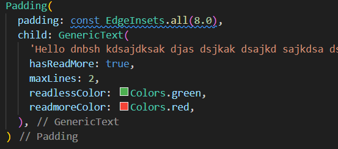
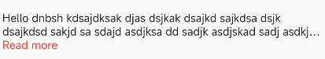
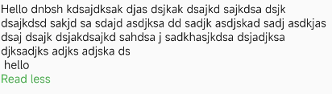

<!--
This README describes the package. If you publish this package to pub.dev,
this README's contents appear on the landing page for your package.

For information about how to write a good package README, see the guide for
[writing package pages](https://dart.dev/guides/libraries/writing-package-pages).

For general information about developing packages, see the Dart guide for
[creating packages](https://dart.dev/guides/libraries/create-library-packages)
and the Flutter guide for
[developing packages and plugins](https://flutter.dev/developing-packages).
-->

This package will create readmore and readless functionality with addition to being similar to normal text widget.

## Features

This package is able to create expadable text widgets.





## Getting started

You can use the package same as the default text widget provided by flutter

## Usage

```dart
        GenericExpandableText(
        'Hello dnbsh kdsajdksak djas dsjkak dsajkd sajkdsa dsjk dsajkdsd sakjd sa sdajd asdjksa dd sadjk asdjskad sadj asdkjas dsaj dsajk dsjakdsajkd sahdsa j sadkhasjkdsa dsjadjksa djksadjks adjks adjska ds \n hello',
        hasReadMore: true,
        maxLines: 1,
        )
```

## Additional information

You can find more information about this package on
https://github.com/RoshanKarki007/generic_expandable_text
